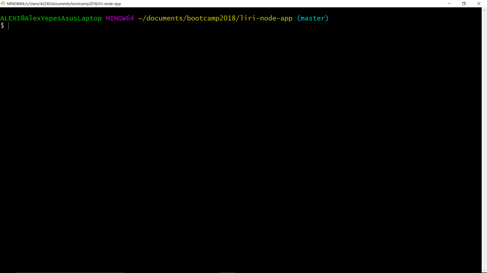
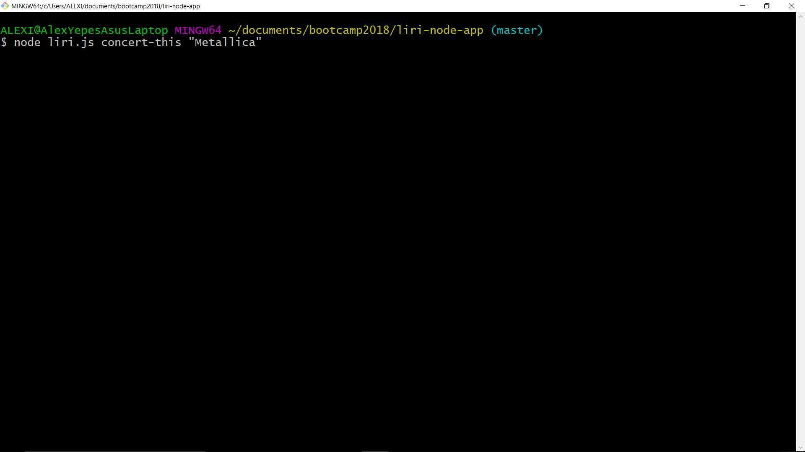
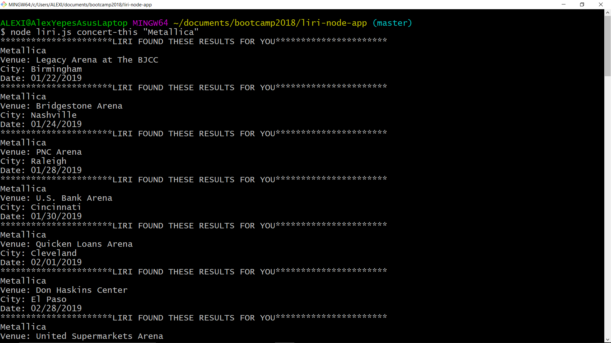

# liri-node-app

Object

There is no HTML page, so I've used screenshots and a video below to explain how it works. Liri has 4 commands:

1) concert-this uses the Request NPM from Bands in town to get information about concerts/location/dates
2) spotify-this-song uses the Spotify NPM to pull information from the returned object based on the song the user is looking for.
3) movie-this uses the Request NPM to pull data from the OMDB database for the user's search.
4) The do-what-it-says command uses fs.write to write to the random.txt file in the directory.

I used a switch with "cases" and corresponding functions to create the four separate commands:

    case "concert-this":
        concertThis();
        break;

    case "spotify-this-song":
        spotifyThisSong();
        break;

    case "movie-this":
        movieThis();
        break;

    case "do-what-it-says":
        doWhatItSays();
        break;

    default: console.log("\n" + "please type any command after: node liri.js: " + "\n" +
        "concert-this  any artist/band name " + "\n" +
        "spotify-this-song  any song title " + "\n" +
        "movie-this  any movie title " + "\n" +
        "do-what-it-says  " + "\n"
};

Instrucions

For LIRI to execute your orders, you need to write: node liri.js followed by one of the 4 commands (see example below). 

concert-this  
spotify-this-song
movie-this
do-what-it-says

Then, write your corresponding search and press Enter.

You will see the results like this:

Examples:

node liri.js concert-this "Metallica"
node liri.js spotify-this-song "Fear of the dark"
node liri.js movie-this "The rock"
node liri.js do-what-it-says

*Don't forget to write your search inside single or double quotes*

A small video shows the demo in action!
please follow the link below

https://drive.google.com/file/d/1pMo0lbMSJNJ2_ml8J4x8AN-Ub89XMLDP/view

